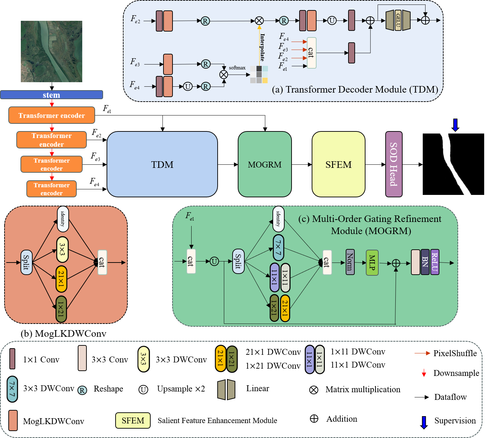

# TLCKD-Net
## Transformer With Large Convolution Kernel Decoder Network for Salient Object Detection in Optical Remote Sensing Images

The official pytorch implementation of the paper "Transformer With Large Convolution Kernel Decoder Network for Salient Object Detection in Optical Remote Sensing Images", [CUIV](https://doi.org/10.1016/j.cviu.2023.103917),2024

### Network Architecture


### Reference
If you use this code or models in your research and find it helpful, please cite the following paper:
```
@article{DONG2024103917,
title = {Transformer with large convolution kernel decoder network for salient object detection in optical remote sensing images},
journal = {Computer Vision and Image Understanding},
pages = {103917},
year = {2024},
issn = {1077-3142},
doi = {https://doi.org/10.1016/j.cviu.2023.103917},
url = {https://www.sciencedirect.com/science/article/pii/S1077314223002977},
author = {Pengwei Dong and Bo Wang and Runmin Cong and Hai-Han Sun and Chongyi Li},
keywords = {Salient object detection, Optical remote sensing image, Transformer, Large convolutional kernel},
abstract = {Despite salient object detection in optical remote sensing images (ORSI-SOD) has made great strides in recent years, it is still a very challenging topic due to various scales and shapes of objects, cluttered backgrounds, and diverse imaging orientations. Most previous deep learning-based methods fails to effectively capture local and global features, resulting in ambiguous localization and semantic information and inaccurate detail and boundary prediction for ORSI-SOD. In this paper, we propose a novel Transformer with large convolutional kernel decoding network, named TLCKD-Net, which effectively models the long-range dependence that is indispensable for feature extraction of ORSI-SOD. First, we utilize Transformer backbone network to perceive global and local details of salient objects. Second, a large convolutional kernel decoding module based on self-attention mechanism is designed for different sizes of salient objects to extract feature information at different scales. Then, a large convolutional refinement and a Salient Feature Enhancement Module are used to recover and refine the saliency features to obtain high quality saliency maps. Extensive experiments on two public ORSI-SOD datasets show that our proposed method outperforms 16 state-of-the-art methods both qualitatively and quantitatively. In addition, a series of ablation studies demonstrate the effectiveness of different modules for ORSI-SOD. Our source code is publicly available at https://github.com/Dpw506/TLCKD-Net.}
}
```
If you encounter any problems with the code, want to report bugs, etc.
Please contact me at tjuwb@nxu.edu.cn or d2568244421@163.com.
